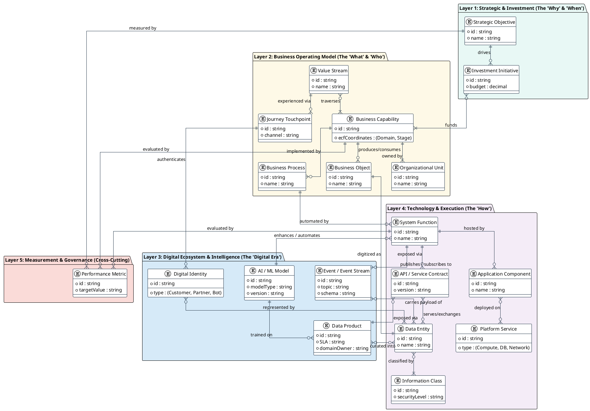

# Enterprise Concept Framework

### An Axiom-Derived, Lifecycle-Aware Matrix for Describing Any Enterprise

**Version 2.0** — Synthesized with TechNeHub Labs DEA ecosystem mapping

---

## 1. Intent and Thesis

The Enterprise Concept Framework (ECF) is a descriptive instrument. Its purpose is stated in a single sentence:

> **Every enterprise — for-profit or not, in any industry — can be completely described as the product of two partitions: the kind of work it does (Domains) and the phases that work passes through (Stages).**

The framework is *axiom-derived*: it is derived from a single grounding axiom, not imported from a named reference framework. It is *lifecycle-aware*: every object and capability is understood to move through phases, never standing still. And it is *industry-agnostic*: the same seven domains and seven stages hold a telecom operator and a digital-services startup without bending.

This document is the full walkthrough. The accompanying slide deck summarizes it; this report carries the detail.

---

## 2. The Grounding Axiom

The framework begins with a single sentence — the definition of an enterprise:

> **An enterprise is any bounded entity that persists by exchanging value with its environment.**

Every word in that sentence generates a domain. The framework is not asserted — it is *derived* from the definition of an enterprise.

### 2.1 Axiomatic Derivation

| Word in the axiom | Generated domain | Why |
|-------------------|-----------------|-----|
| "bounded entity" | → Governance & Existence | Boundedness requires a boundary — who is inside, what rules apply, what constitutes the entity itself. |
| "persists" | → Supply & Resources | Persistence requires a substrate — the physical or virtual assets that keep the entity alive over time. |
| "persists" | → People & Organization | Persistence requires agents — the humans who perform the work and the structure that organizes them. |
| "exchanging value" | → Customer & Demand | Exchange requires a counterparty — the people whose need the entity meets, and the demand they generate. |
| "exchanging value" | → Product & Offering | Exchange requires something to offer — the catalog of what the entity provides to meet demand. |
| "exchanging value" | → Operations & Delivery | Exchange requires a mechanism — the engine that turns the offering into a delivered outcome. |
| "with its environment" | → Finance & Value | The environment requires accounting — the measurement of value created, consumed, and retained. |

Each domain is a logical consequence of a word in the axiom, not an assertion. This is what makes the framework bottom-up: it is derived from the definition of an enterprise, not reverse-engineered from a specific industry's practices.

---

## 3. Design Principles

The framework obeys eight rules:

1. **Universality.** The framework must apply to any enterprise — a 50-person charity, a 500,000-person telco, a hospital, a government agency — without modification.
2. **MECE.** The two partitions (domains and stages) are mutually exclusive and collectively exhaustive. A capability belongs to exactly one domain; an object is in exactly one stage at a time.
3. **Lifecycle continuity.** Every business object passes through every stage. Nothing is "born live."
4. **Orthogonality.** The two axes are independent. Knowing an object's domain does not determine its stage, and vice versa.
5. **Minimality.** The fewest constructs that fully describe the enterprise. Seven domains and seven stages are the minimum.
6. **Traceability.** Every cell traces to an owner (actor), a state (stage), and a set of dependencies (other cells).
7. **Evolvability.** The matrix is versioned. Each planning cycle produces a snapshot; diffing reveals what changed.
8. **Bottom-up.** Derived from the axiom, not imported from eTOM, ITIL, COBIT, Zachman, or any other named framework.

---

## 4. Why Bottom-Up

Named frameworks — eTOM (telecom), ITIL (IT service management), COBIT (governance), Zachman (architecture) — were each reverse-engineered from a specific context. Adopting them wholesale imports that context's blind spots.

An axiom-derived matrix carries no foreign assumptions. It fits the enterprise because it was derived from the definition of an enterprise. The cost is the work of derivation; the benefit is a description that does not need to be bent to fit.

---

## 5. The Two Axes

### 5.1 Domains (Rows) — Scope of Operations

The **domains** answer the question *what does the enterprise do?* Seven domains, each derived from a word in the grounding axiom:

| # | Domain | One-line definition |
|---|--------|---------------------|
| 1 | Governance & Existence | The precondition of boundedness — what defines the entity, what rules apply, and the assurance that the other domains behave. |
| 2 | Supply & Resources | The substrate the enterprise persists on — physical or virtual, owned or rented — and its capacity, health, and disposal. |
| 3 | People & Organization | The humans who perform every capability — their structure, skills, performance, and movement. |
| 4 | Customer & Demand | The enterprise's reason to exchange: identifying, acquiring, serving, and retaining the people whose need it meets. |
| 5 | Product & Offering | The catalog of what the enterprise offers — its design, packaging, release, and retirement. |
| 6 | Operations & Delivery | The engine that turns an offering into a delivered outcome — planning, fulfilling, running, resolving. |
| 7 | Finance & Value | The accounting for the environment — the flow of money and the measurement of value created, consumed, and retained. |

### 5.2 Stages (Columns) — Value Stream Stages

The **stages** answer the question *how does the work evolve?* Seven stages, partitioned by lifecycle phase:

| # | Stage (short) | Stage (full) | One-line definition |
|---|---------------|-------------|---------------------|
| 1 | Conceive | Conceive | Naming the need, the opportunity, the policy. The enterprise decides what should exist. |
| 2 | Design | Design | Specifying the object, the process, the controls. The enterprise shapes what it will build. |
| 3 | Build | Build / Acquire | Constructing, provisioning, hiring, or buying. The object becomes real but is not yet live. |
| 4 | Activate | Deploy / Activate | Cutting over, launching, mobilizing. The object enters service and begins to deliver value. |
| 5 | Operate | Operate / Deliver | Running, serving, monitoring, maintaining. Where the object spends most of its life. |
| 6 | Improve | Measure / Learn | Measuring performance, learning from incidents, scoring satisfaction. The enterprise decides what to change. |
| 7 | Retire | Retire / Renew | Sunsetting, migrating, recovering, or renewing. The object exits its current form. |

### 5.3 Why These Axes

The domains are *derived* — each falls out of the axiom as a logical consequence. The stages are *universal* — they are the lifecycle every object, capability, and asset must traverse. The two axes are orthogonal, which is what makes the matrix a grid rather than a list.

---

## 6. Formal Definitions

The framework uses eight constructs:

- **Business object.** A thing the enterprise cares about — a customer, a circuit, a feature flag, a grant. The atom of the matrix.
- **Entity.** A business object with a unique identity and a persistent state.
- **Capability.** The ability to do something with an object — provision, bill, monitor, retire.
- **Value stream.** The end-to-end flow that carries an object across all seven stages.
- **State.** A named phase in an object's lifecycle — proposed, designed, provisioned, active, retired.
- **Event.** A state transition — signup, cut-over, incident, sunset.
- **Actor.** The owner or performer of a capability — a person, team, or system.
- **Resource.** The asset consumed by a capability — spectrum, compute, budget, hours.

### How Constructs Relate

Each cell **C(d, s)** holds the objects in domain *d* currently in stage *s*, the capabilities that act on them, the events that move them, the actors who perform, and the resources consumed. A cell is a snapshot of one domain at one stage — a bounded, inspectable unit of the enterprise.

---

## 7. MECE Sub-Decomposition

### 7.1 Domain Subdomains

| Domain | Subdomains |
|--------|-----------|
| Governance & Existence | Policy, Controls, Compliance, Assurance, Retirement |
| Supply & Resources | Capacity, Build/procure, Integration, Monitoring, Disposal |
| People & Organization | Planning, Acquisition, Mobilization, Development, Exit |
| Customer & Demand | Acquisition, Onboarding, Care & support, Retention, Offboarding |
| Product & Offering | Catalog, Packaging, Pricing, Lifecycle, Sunset |
| Operations & Delivery | Planning, Fulfillment, Run, Incident, Decommission |
| Finance & Value | Business case, Funding, Billing, Revenue, Recovery |

### 7.2 Stage Substages

| Stage | Substages |
|-------|----------|
| Conceive | Sense, Frame, Decide |
| Design | Specify, Review, Baseline |
| Build / Acquire | Provision, Configure, Accept |
| Deploy / Activate | Integrate, Cut-over, Verify |
| Operate / Deliver | Run, Monitor, Resolve |
| Measure / Learn | Collect, Analyze, Decide |
| Retire / Renew | Migrate, Recover, Archive |

### 7.3 Why the Split Is MECE

Domains partition by *kind of work*. A capability belongs to exactly one domain because it answers exactly one "what" question. Stages partition by *phase*. An object is in exactly one stage at a time because its state is singular. Together the seven domains and seven stages cover the enterprise completely.

---

## 8. Matrix Construction and Usage Rules

### 8.1 Construction Rules (expanded)

1. **Map domains to rows.** Place each of the seven domains on a row, in axiomatic order: governance first, finance last.
2. **Map stages to columns.** Place each of the seven stages on a column, left to right, in lifecycle order.
3. **Place objects in cells.** Each business object goes in the cell at the intersection of its domain and its current stage.
4. **One object, one primary cell.** If an object spans domains, model it as a linking object — never duplicate it across rows.
5. **Capabilities map to earliest stage.** A capability belongs to the stage where it is first initiated, not where it runs longest.
6. **Attach capabilities.** Within each cell, list the capabilities that act on those objects.
7. **Mark events and actors.** Annotate each cell with the events that trigger transitions and the actors who perform.
8. **Version the matrix.** Snapshot at each planning cycle; diff to see what moved.

### 8.2 Value Stream Overlay Routes

Cross-cutting concerns are modeled as *directed graphs routing through specific cells* — not as blanket layers draped over the whole grid. A route names the handoffs; a layer does not.

**Commercialization route:**
```
Finance × Design     → pricing
Product × Activate   → channel launch
Operations × Operate  → perform
Finance × Operate     → bill
Finance × Measure     → margin
```

**Statutory compliance route:**
```
Governance × Conceive → mandate
Governance × Design   → controls
Governance × Build    → evidence
Governance × Activate → enforce
Governance × Operate  → assure
```

### 8.3 Monetization and Profit vs Non-Profit

The monetization spine — **Perform → Account → Bill** (Operations × Operate → Finance × Operate → Finance × Measure) — exists in every enterprise. What changes is the payload.

A telco's Finance × Design holds a "tariff model"; a non-profit's holds a "funding model." A telco's Finance × Operate is "revenue recognition"; a non-profit's is "grant recognition." Same cells, different content. Profit vs non-profit is a payload difference in the Finance domain, not a structural change — the framework stays identical.

### 8.4 Versioning and Recursive Self-Similarity

The matrix is a living artifact. Each planning cycle produces a snapshot. Objects move across columns as they mature; capabilities shift within cells as the enterprise learns. Diffing two snapshots reveals exactly what changed.

Any cell can be decomposed into its own 7×7 sub-matrix — the cell's objects become the enterprise described by the sub-matrix. This gives infinite depth without changing the top-level logic. The framework scales because it does not grow; it recurses. A 50-person charity and a 500,000-person telco occupy the same grid — only the depth of decomposition differs.

### 8.5 Anti-Patterns

- **Mixing axes:** putting a stage inside the domain column. The axes must stay orthogonal.
- **Overloading a cell:** stuffing a cell with objects from another domain to avoid creating a new row.
- **Skipping stages:** assuming an object is "born live." Every object has a Conceive and a Build stage.
- **Static matrix:** treating the matrix as a one-time diagram. It must version with the enterprise.

---

## 9. The Canonical Foundation Matrix

| Domain \ Stage | Conceive | Design | Build | Activate | Operate | Improve | Retire |
|----------------|----------|--------|-------|----------|---------|---------|--------|
| Governance & Existence | Policy intent | Controls design | Compliance build | Enforce | Assurance | Risk review | Policy retire |
| Supply & Resources | Capacity vision | Architecture | Build / procure | Integration | Monitoring | Utilization | Retire assets |
| People & Organization | Workforce plan | Org design | Hire / train | Mobilize | Perform & develop | Engagement | Offboard / reassign |
| Customer & Demand | Need identification | Journey mapping | Onboarding | Activation | Support & service | Satisfaction & churn | Offboarding |
| Product & Offering | Market sensing | Catalog & specs | Configuration | Launch | Catalog mgmt | Performance | Sunset |
| Operations & Delivery | Demand planning | Process design | Provisioning | Cut-over | Run & maintain | Quality & incident | Decommission |
| Finance & Value | Business case | Pricing model | Funding | Billing activation | Revenue & cost | Margin analysis | Write-off |

### Patterns the Foundation Reveals

1. **Diagonal flow.** Objects move left to right across rows; the matrix makes the lifecycle visible as motion.
2. **Column coupling.** Adjacent stages share events — a Build exit is an Activate entry — surfacing handoff risks.
3. **Row completeness.** A sparse row signals a neglected domain; a sparse column signals a skipped stage.

---

## 10. Case Study: Telecom

| Domain \ Stage | Conceive | Design | Build | Activate | Operate | Improve | Retire |
|----------------|----------|--------|-------|----------|---------|---------|--------|
| Governance & Existence | Reg. mandate (TRA) | Controls design (SOX) | Compliance build (DPI) | Audit enforce | Lawful intercept | Risk review | Policy repeal |
| Supply & Resources | Spectrum vision (RAN) | Core arch. (EPC/5GC) | Equip. install | Network integ. | NMS monitoring | KPI utilization (erlang) | Equip. retire |
| People & Organization | Field force plan | NOC/org design | Engineer training | Crew dispatch | Performance (OKR) | Engagement | Redeploy |
| Customer & Demand | Subscriber need | Tariff plans | SIM provisioning | Network attach (HLR/HSS) | Customer care (CRM) | Churn scoring (ARPU) | Number port (MNP) |
| Product & Offering | Service roadmap (5G) | Service catalog (BSS) | Bundle config | Commercial launch | Catalog lifecycle (OSS) | Service uptake | Plan sunset |
| Operations & Delivery | Traffic forecast | Network design | Circuit prov. | Site cut-over | NOC operations (24/7) | Fault mgm (TT) | Site decom. |
| Finance & Value | Investment case | Tariff model (regulator) | Funding approval | Billing start (mediation) | Revenue recog. (ARPU) | Margin by plan (EBITDA) | Asset impair. |

### Telecom Patterns

- The **Operations × Activate** cell — network attach via HLR/HSS — is the telco's highest-risk handoff; the matrix isolates it for investment.
- The **Finance × Operate** cell — mediation and rating — runs continuously; the matrix shows it as the revenue engine, not a back-office afterthought.

---

## 11. Case Study: Digital Services

| Domain \ Stage | Conceive | Design | Build | Activate | Operate | Improve | Retire |
|----------------|----------|--------|-------|----------|---------|---------|--------|
| Governance & Existence | Privacy policy | Controls design (SOC2) | Compliance build | Enforce (guardrails) | Audit log | Risk review (pentest) | Policy retire |
| Supply & Resources | Scale vision | Cloud arch. (AWS/GCP) | Infra build (Terraform) | Service mesh | Observability | Cost/usage (FinOps) | Infra retire |
| People & Organization | Team topology | Org design (pods) | Hire / onboard | Sprint mobilize | Perf review (360) | Engagement (eNPS) | Offboard |
| Customer & Demand | User need (JTBD) | Persona map | Signup flow | Activation event (aha) | In-product help | Retention cohort (DAU) | Account deletion (GDPR) |
| Product & Offering | Discovery | Feature spec (PRD) | Build sprint | Feature flag launch | Roadmap mgmt | Feature adoption | Deprecation |
| Operations & Delivery | Demand forecast | Pipeline design (CI/CD) | Provision env (IaC) | Deploy to prod (canary) | SRE on-call (SLO) | Incident review (PSE) | Env teardown |
| Finance & Value | Unit econ (LTV) | Pricing tier (SaaS) | Funding round | Subscription start (stripe) | MRR / churn | Cohort margin (CAC) | Dunning / refund |

### Digital Services Patterns

- The **Product × Activate** cell — feature flag rollout — is the digital company's equivalent of the telco cut-over: the moment of risk.
- The **Supply × Improve** cell — FinOps — shows that in digital, cost is a runtime concern, not an annual one. The matrix makes this visible where an org chart would not.

---

## 12. Cross-Industry Comparison

| Cell | Telecom | Digital Services |
|------|---------|------------------|
| Customer × Activate | Network attach (HLR/HSS) | Activation event (aha-moment) |
| Product × Build | Bundle configuration | Build sprint (agile) |
| Operations × Operate | NOC 24/7 | SRE on-call (SLO) |
| Supply × Improve | Erlang utilization | FinOps cost/usage |
| Finance × Operate | Mediation & rating | MRR / churn |
| Governance × Conceive | Regulatory mandate (TRA) | Privacy policy intent |

The cell address is identical. Only the content changes. The framework did not change to fit either industry; both fit the framework.

---

## 13. Derived Artifacts

The matrix produces five concrete outputs:

1. **Entity catalog.** Every business object, its domain, stage, and owner. The system of record.
2. **Capability map.** Every capability, the cell it belongs to, and the actor who performs it.
3. **Data model seeds.** The objects and events per cell, seeding schema design.
4. **Integration contract list.** The handoffs between adjacent cells — the seams to wire.
5. **Lifecycle traceability matrix.** Object → stage → event → actor, end to end.

Every artifact is a projection of the matrix. Nothing in the artifacts exists that the matrix does not explain, and nothing in the matrix is lost in the artifacts.

---

## 14. Catalog Schema

A canonical business object catalog entry, with typed attributes, structured owners, and real compliance standards:

```json
{
  "id": "tel.subscriber.001",
  "name": "Subscriber",
  "domain": "Customer & Demand",
  "lifecycleStage": "Deploy / Activate",
  "attributes": [
    { "name": "msisdn", "type": "string", "required": true },
    { "name": "imsi",   "type": "string", "required": true },
    { "name": "planId", "type": "ref",    "required": true },
    { "name": "status", "type": "enum",   "required": true }
  ],
  "owners": [
    { "actorId": "care-ops",          "role": "primary" },
    { "actorId": "revenue-assurance", "role": "secondary" }
  ],
  "relatedObjects": [
    { "id": "tel.plan.5g-pre", "rel": "subscribed-to" },
    { "id": "tel.circuit.7",   "rel": "uses" }
  ],
  "complianceTags": ["KYC", "ASC-606", "data-retention"],
  "version": "2026.07"
}
```

### Sample Populated Entries — Two Worlds, One Schema

**Telecom:**
```json
{
  "id": "tel.subscriber.001",
  "name": "Subscriber",
  "domain": "Customer & Demand",
  "stage": "Deploy / Activate",
  "attributes": [
    { "name": "msisdn", "type": "string", "required": true },
    { "name": "imsi",   "type": "string", "required": true },
    { "name": "planId", "type": "ref",    "required": true }
  ],
  "owners": [{ "actorId": "care-ops", "role": "primary" }],
  "complianceTags": ["KYC", "ASC-606"],
  "version": "2026.07"
}
```

**Digital Services:**
```json
{
  "id": "dig.user.001",
  "name": "User account",
  "domain": "Customer & Demand",
  "stage": "Deploy / Activate",
  "attributes": [
    { "name": "userId",   "type": "string", "required": true },
    { "name": "email",     "type": "string", "required": true },
    { "name": "planTier",  "type": "enum",   "required": true }
  ],
  "owners": [{ "actorId": "growth-team", "role": "primary" }],
  "complianceTags": ["GDPR"],
  "version": "2026.07"
}
```

---

## 15. Formal Notation

```
type Domain = 1..7;   // rows
type Stage  = 1..7;   // columns

// the matrix is the cartesian product
M = D × S = { (d, s) | d ∈ D, s ∈ S }

// a cell holds objects + their capabilities
type Cell_{d,s} = {
  objects: Entity[],
  caps: Capability[]
}

// an object's lifecycle is a path
lifecycle(o) = ⟨ s₁ → s₂ → … → s₇ ⟩

// any cell recurses into a sub-matrix
decompose : Cell → M   // C(d,s) → 7×7 sub-grid
```

### Traceability Functions

```
// who owns an object
owner : Entity → Actor

// what state it's in (which column)
state : Entity → Stage

// what it depends on (other cells)
deps  : Entity → 2^Entity

// impact closure: change ripples
impact(e) = deps*(e) = ⋃ depsⁿ(e), n ≥ 0
```

### Impact Propagation — Worked Example with Formal Closure

A change in one cell, traced:

- **Change:** a tariff plan is retired (Product × Retire).
- **→ deps:** every subscriber on that plan (Customer × Operate) is affected.
- **→ deps:** every billing account linked to those subscribers (Finance × Operate) must re-rate.

Formal closure:
```
closure(c₁) = deps(c₁) ∪ deps(deps(c₁)) ∪ ∅
           = {c₂, c₃} ∪ {c₄} ∪ ∅
           = {c₂, c₃, c₄}

impact(c₄) = {c₁, c₂, c₃}  // reverse closure
```

The `impact` function computes the transitive closure of dependencies, revealing the full blast radius of a single change.

---

## 16. Enterprise Concepts Metamodel

The Enterprise Concepts Metamodel formalizes the framework's constructs as a typed entity-relationship model. It is organized into five layers, each answering a different question about the enterprise. The metamodel is the bridge between the conceptual matrix (Section 9) and the concrete artifacts (Section 13): it specifies the entity types, their attributes, and the relationships between them.

The five layers are:

1. **Strategic & Investment** — the 'Why' & 'When'
2. **Business Operating Model** — the 'What' & 'Who'
3. **Digital Ecosystem & Intelligence** — the 'Digital Era'
4. **Technology & Execution** — the 'How'
5. **Measurement & Governance** — cross-cutting

Layer 3 (Digital Ecosystem & Intelligence) is new to this version of the metamodel. It captures the digital-era constructs that have become first-class citizens of enterprise architecture: digital identities, event streams, AI/ML models, and data products. These entities sit between the business operating model and the technology execution layer, reflecting the reality that digital concerns are neither purely business nor purely technology — they are a distinct stratum.

### 16.1 Layer 1 — Strategic & Investment (The 'Why' & 'When')

| Entity | Attributes |
|--------|-----------|
| **Strategic Objective** | `id: string`, `name: string` |
| **Investment Initiative** | `id: string`, `budget: decimal` |

**Relationships:**
- Strategic Objective `drives` Investment Initiative (1 — 0..*)
- Investment Initiative `funds` Business Capability (0..* — 1..*)

This layer captures the enterprise's intent. Strategic objectives define what the enterprise is trying to achieve; investment initiatives are the funded programs that create or change capabilities to meet those objectives.

### 16.2 Layer 2 — Business Operating Model (The 'What' & 'Who')

| Entity | Attributes |
|--------|-----------|
| **Value Stream** | `id: string`, `name: string` |
| **Business Capability** | `id: string`, `ecfCoordinates: (Domain, Stage)` |
| **Business Process** | `id: string`, `name: string` |
| **Business Object** | `id: string`, `name: string` |
| **Journey Touchpoint** | `id: string`, `channel: string` |
| **Organizational Unit** | `id: string`, `name: string` |

**Relationships:**
- Value Stream `traverses` Business Capability (0..* — 1..*)
- Value Stream `experienced via` Journey Touchpoint (1 — 0..*)
- Business Capability `implemented by` Business Process (1 — 0..*)
- Business Capability `owned by` Organizational Unit (1 — 1..*)
- Business Capability `produces/consumes` Business Object (1 — 0..*)

This layer is the heart of the metamodel. The **Business Capability** entity carries an explicit `ecfCoordinates: (Domain, Stage)` attribute — it knows which cell of the 7×7 matrix it belongs to. Value streams are the directed routes through cells (Section 8.2); business processes are the step-by-step implementations; organizational units are the owners; and journey touchpoints are where the customer experiences the value stream.

### 16.3 Layer 3 — Digital Ecosystem & Intelligence (The 'Digital Era')

| Entity | Attributes |
|--------|-----------|
| **Digital Identity** | `id: string`, `type: (Customer, Partner, Bot)` |
| **Event / Event Stream** | `id: string`, `topic: string`, `schema: string` |
| **AI / ML Model** | `id: string`, `modelType: string`, `version: string` |
| **Data Product** | `id: string`, `SLA: string`, `domainOwner: string` |

**Relationships (Layer 2 → Layer 3):**
- Journey Touchpoint `authenticates` Digital Identity (1 — 0..*)
- Digital Identity `represented by` Data Entity (0..* — 1..*)
- Business Process `automated by` System Function (1 — 0..*) *(cross-layer to Layer 4)*
- Business Object `digitized as` Data Entity (1 — 1) *(cross-layer to Layer 4)*

**Relationships (Layer 3 internal):**
- Data Entity `classified by` Information Class (0..* — 1..*) *(cross-layer to Layer 4)*
- Data Entity `curated into` Data Product (0..* — 0..*)
- System Function `publishes / subscribes to` Event / Event Stream (1 — 0..*) *(cross-layer to Layer 4)*
- Event / Event Stream `carries payload of` Data Entity (0..* — 0..*) *(cross-layer to Layer 4)*
- Data Product `exposed via` API / Service Contract (1 — 0..*) *(cross-layer to Layer 4)*
- AI / ML Model `trained on` Data Product (1 — 0..*)
- AI / ML Model `enhances / automates` System Function (1 — 0..*) *(cross-layer to Layer 4)*

This layer is the digital-era overlay. It recognizes that modern enterprises operate with digital identities (not just organizational units), event streams (not just batch processes), AI/ML models (not just application logic), and data products (not just data entities). These constructs bridge the business and technology layers: a journey touchpoint authenticates a digital identity; a data product is curated from data entities and exposed via APIs; an AI model trains on data products and enhances system functions.

### 16.4 Layer 4 — Technology & Execution (The 'How')

| Entity | Attributes |
|--------|-----------|
| **System Function** | `id: string`, `name: string` |
| **Application Component** | `id: string`, `name: string` |
| **API / Service Contract** | `id: string`, `version: string` |
| **Data Entity** | `id: string`, `name: string` |
| **Information Class** | `id: string`, `securityLevel: string` |
| **Platform Service** | `id: string`, `type: (Compute, DB, Network)` |

**Relationships:**
- System Function `hosted by` Application Component (1 — 0..*)
- Application Component `deployed on` Platform Service (0..* — 0..*)
- System Function `exposed via` API / Service Contract (1 — 0..*)
- API / Service Contract `serves/exchanges` Data Entity (0..* — 0..*)

This layer is the implementation. System functions are hosted by application components, which deploy on platform services (compute, database, network). APIs serve and exchange data entities across the stack. Note that **Technology Component** from the previous version has been replaced by **Platform Service**, reflecting the cloud-native reality of modern infrastructure.

### 16.5 Layer 5 — Measurement & Governance (Cross-Cutting)

| Entity | Attributes |
|--------|-----------|
| **Performance Metric** | `id: string`, `targetValue: string` |

**Relationships:**
- Strategic Objective `measured by` Performance Metric (1 — 0..*)
- Business Capability `evaluated by` Performance Metric (1 — 0..*)
- System Function `evaluated by` Performance Metric (1 — 0..*)

Layer 5 is cross-cutting: it is not a sequential phase but a continuous concern. Performance metrics measure strategic objectives (Layer 1), evaluate business capabilities (Layer 2), and evaluate system functions (Layer 4). This is why the metamodel draws Layer 5 as a cross-cutting badge rather than a sequential layer — governance and measurement happen at every stage of the lifecycle.

### 16.6 How the Metamodel Links to ECF

Every entity in the metamodel lives in a cell of the 7×7 matrix. The **Business Capability** entity carries an explicit `ecfCoordinates: (Domain, Stage)` attribute — the metamodel knows which cell it is in.

The five layers map onto ECF as follows:

| Metamodel Layer | ECF Domain | ECF Stage |
|-----------------|-----------|-----------|
| Layer 1 — Strategic & Investment | Finance & Value | Conceive |
| Layer 2 — Business Operating Model | All seven domains | All seven stages |
| Layer 3 — Digital Ecosystem & Intelligence | Customer & Supply domains | Build → Operate |
| Layer 4 — Technology & Execution | Supply & Resources | Build → Operate |
| Layer 5 — Measurement & Governance | Governance & Existence | Cross-cutting (all stages) |

### 16.7 Relationship Summary

| From | Cardinality | To | Verb |
|------|-----------|----|------|
| Strategic Objective | 1 — 0..* | Investment Initiative | drives |
| Investment Initiative | 0..* — 1..* | Business Capability | funds |
| Value Stream | 0..* — 1..* | Business Capability | traverses |
| Value Stream | 1 — 0..* | Journey Touchpoint | experienced via |
| Business Capability | 1 — 0..* | Business Process | implemented by |
| Business Capability | 1 — 1..* | Organizational Unit | owned by |
| Business Capability | 1 — 0..* | Business Object | produces/consumes |
| Journey Touchpoint | 1 — 0..* | Digital Identity | authenticates |
| Digital Identity | 0..* — 1..* | Data Entity | represented by |
| Business Process | 1 — 0..* | System Function | automated by |
| Business Object | 1 — 1 | Data Entity | digitized as |
| Data Entity | 0..* — 1..* | Information Class | classified by |
| Data Entity | 0..* — 0..* | Data Product | curated into |
| System Function | 1 — 0..* | Event / Event Stream | publishes / subscribes to |
| Event / Event Stream | 0..* — 0..* | Data Entity | carries payload of |
| Data Product | 1 — 0..* | API / Service Contract | exposed via |
| AI / ML Model | 1 — 0..* | Data Product | trained on |
| AI / ML Model | 1 — 0..* | System Function | enhances / automates |
| System Function | 1 — 0..* | Application Component | hosted by |
| Application Component | 0..* — 0..* | Platform Service | deployed on |
| System Function | 1 — 0..* | API / Service Contract | exposed via |
| API / Service Contract | 0..* — 0..* | Data Entity | serves/exchanges |
| Strategic Objective | 1 — 0..* | Performance Metric | measured by |
| Business Capability | 1 — 0..* | Performance Metric | evaluated by |
| System Function | 1 — 0..* | Performance Metric | evaluated by |

### 16.8 What Changed From the Previous Version

The metamodel has been updated to reflect the digital-era realities of modern enterprise architecture. The key changes are:

- **Added Layer 3 (Digital Ecosystem & Intelligence).** This new layer introduces four entities — Digital Identity, Event / Event Stream, AI / ML Model, and Data Product — that capture digital-era constructs as first-class citizens.
- **Renumbered layers.** The former Layer 3 (Technology & Execution) is now Layer 4; the former Layer 4 (Measurement & Governance) is now Layer 5.
- **Removed entities.** Business Function has been removed from Layer 2 (its role is now absorbed by Organizational Unit). Technology Component has been removed from Layer 4 (replaced by Platform Service).
- **Added entities.** Platform Service has been added to Layer 4, reflecting cloud-native infrastructure (compute, database, network).
- **Added relationships.** Seven new relationships connect the digital layer to the business and technology layers: Journey Touchpoint authenticates Digital Identity; Digital Identity is represented by Data Entity; Data Entity is curated into Data Product; System Function publishes/subscribes to Event Stream; Event Stream carries payload of Data Entity; Data Product is exposed via API; AI/ML Model trains on Data Product and enhances System Function.
- **Simplified attributes.** Several entities have been streamlined (e.g., Strategic Objective no longer carries a `type` attribute; Investment Initiative no longer carries `name` or `status`).

---

## 17. Metrics

```
// coverage: how full is the matrix?
coverage = |filled cells| / |D × S|

// coupling: how many deps cross cells?
coupling = |{ (a,b) ∈ deps | cell(a) ≠ cell(b) }| / |deps|

// lifecycle completeness: do objects traverse all 7 stages?
lifecycle(o) = |stages(o)| / 7
```

---

## 18. Visual Representation

### The Matrix at a Glance

```
| Domain \ Stage  | Cnc | Des | Bld | Act | Opr | Imp | Ret |
|----------------|-----|-----|-----|-----|-----|-----|-----|
| Governance     |  ●  |  ●  |  ●  |  ●  |  ●  |  ●  |  ●  |
| Supply         |  ●  |  ●  |  ●  |  ●  |  ●  |  ●  |  ●  |
| People         |  ●  |  ●  |  ●  |  ●  |  ●  |  ●  |  ●  |
| Customer       |  ●  |  ●  |  ●  |  ★  |  ●  |  ●  |  ●  |
| Product        |  ●  |  ●  |  ●  |  ●  |  ●  |  ●  |  ●  |
| Operations     |  ●  |  ●  |  ★  |  ●  |  ★  |  ●  |  ●  |
| Finance        |  ●  |  ●  |  ●  |  ●  |  ★  |  ●  |  ●  |

  ● = active   ★ = high-risk handoff
```

### Rendering Guidance

- **Color:** One accent per domain; stages share a neutral ramp. Never color both axes.
- **Grouping:** Group cells by domain (row) with a hairline. Do not group by stage.
- **Legend:** Mark high-risk handoffs (★) and steady-state (●). Keep the legend to two glyphs.
- **Emphasis:** When presenting, highlight one row or one column — never the whole grid at once.

---

## 19. Adoption Playbook (expanded to five steps)

A two-week sprint:

### Step 1 — Map (Days 1–4)
Workshop with domain leads. Place every top-50 business object in a cell.
- **Deliverable:** the first matrix snapshot.

### Step 2 — Validate (Days 5–7)
Walk each row and column with the operating teams. Confirm cell ownership, mark handoffs.
- **Deliverable:** annotated matrix with owners and handoffs marked.

### Step 3 — Metrics & Reconcile (Days 8–10)
Compute coverage, coupling, and lifecycle completeness. Reconcile the matrix against existing capability maps.
- **Deliverable:** metrics report identifying gaps and discrepancies.

### Step 4 — Operate (Days 11–13)
Wire the matrix into the planning cycle. Snapshot each sprint; diff to drive change.
- **Deliverable:** a living matrix that versions with each cycle.

### Step 5 — Govern (Day 14)
Establish the governance cadence — who owns the matrix, how it versions, how changes are reviewed.
- **Deliverable:** governance charter.

---

## 20. Defensibility

### "This just duplicates existing frameworks."

It doesn't. eTOM and ITIL describe *how* a telco or an IT shop works. This framework describes *what any enterprise is* — the skeleton the others hang on. eTOM is a projection of this matrix onto the telecom industry; ITIL is a projection onto IT service management.

### "It's too abstract."

It's exactly as abstract as a skeleton needs to be. The cells are where the concrete work lives. The framework specifies *where* a capability lives and *what* it relates to; it does not pretend to specify what a telco's HLR/HSS does.

### "It won't scale."

The matrix is 7×7 regardless of enterprise size. Any cell decomposes into a 7×7 sub-matrix, giving infinite depth without changing the top-level logic. The framework scales because it does not grow; it recurses.

### "It's industry-specific."

The Telecom and Digital Services case studies prove otherwise. A telco's HLR/HSS cut-over and a SaaS company's feature flag rollout live in the same cell — Customer × Activate. Identical structure, different content, no bending.

---

## 21. Mapping to TechNeHub Labs

### 20.1 What TechNeHub Labs Is

TechNeHub Labs is an open-source, vendor-neutral reference framework for Digital Enterprise Architecture (DEA). It is currently in alpha, with 10 repositories across a four-layer architecture:

```
L0 — Metamodel         Core entity definitions, JSON Schema, TTL ontology, SQLite schema
L1 — Reference Catalogs  Principles · Standards · Patterns · Glossary · Taxonomy · Metrics · Reference Models
L2 — Tooling           CLI · Code generators · Web viewer · Scripts · Packaging
L3 — Governance        Branch strategy · Release process · SBOM · CODEOWNERS · MIT licensing
```

The centerpiece is **DERA** — the Digital Enterprise Reference Architecture — which assembles all catalogs into a four-phase adoption programme: Discover & Define → Design & Build → Deploy & Operate → Evolve & Retire.

### 20.2 The Core Relationship

**ECF is the conceptual skeleton; DEA is the implementation tooling.**

ECF says *what any enterprise is* — 7 domains × 7 stages, derived from a single axiom. DEA says *how to architect one* — metamodel, catalogs, tooling, governance. ECF is the conceptual layer above DEA's L0 metamodel. The metamodel's entity types are instances of ECF's constructs; the catalogs are instances of ECF's cells.

### 20.3 Domain → Catalog Mapping

| ECF Domain | DEA Repo(s) | What it holds |
|------------|-------------|---------------|
| Governance & Existence | `dea-catalog-principles`, `dea-catalog-standards` | Architecture principles (API-first, Zero Trust) and technical standards (REST, OAuth2) — the guardrails. |
| Supply & Resources | `dea-catalog-reference-models`, `dea-catalog-solution-hub` | Platform systems, IaC accelerators (CDP, API Gateway, Event Streaming, Identity). |
| People & Organization | `dea-catalog-digital-business-service-factory` | HR business service — workforce capability maps and SLA governance. |
| Customer & Demand | `dea-catalog-digital-business-service-factory` | Customer business service — acquisition, onboarding, care, retention. |
| Product & Offering | `dea-catalog-digital-business-service-factory`, `dea-catalog-solution-hub` | Product business service + solution archetypes and delivery templates. |
| Operations & Delivery | `dea-catalog-patterns`, `dea-catalog-solution-hub` | Architecture patterns (CQRS, Saga, Strangler Fig) + workflow accelerators. |
| Finance & Value | `dea-catalog-digital-business-service-factory`, `dea-catalog-metrics` | Finance business service + KPIs and measurement frameworks. |

### 20.4 Stage → DERA Phase Mapping

| DERA Phase | ECF Stages |
|-----------|------------|
| Phase 1 — Discover & Define | Conceive + Design |
| Phase 2 — Design & Build | Build + Activate |
| Phase 3 — Deploy & Operate | Operate + Improve |
| Phase 4 — Evolve & Retire | Retire |

ECF's finer granularity (7 vs 4) is the deeper lens; DERA is the coarser delivery wrapper that groups adjacent stages.

### 20.5 Construct → Metamodel Entity Mapping

| ECF Construct | DEA Metamodel Entity |
|---------------|---------------------|
| Business object | `BusinessService` |
| Capability | `BusinessCapability` |
| Pattern / Standard | `ArchitecturePattern` / `Standard` |
| Domain / Stage | `TaxonomyNode` (the 7×7 grid = top two taxonomy levels) |
| Actor | `SolutionComponent` owner |
| Metric | `MeasurementMetric` |
| Relationship | `Relationship` (typed, governed) |

### 20.6 Where ECF Fits Best

ECF belongs as the conceptual foundation of `dea-catalog-taxonomy`. The 7 domains and 7 stages are the top-level classification hierarchy that every other catalog hangs from. Today the taxonomy repo is empty — ECF would seed it.

ECF's derived artifacts (entity catalog, capability map, traceability matrix) are exactly what `dea-catalog-digital-business-service-factory` and `dea-catalog-reference-architecture` produce. ECF provides the conceptual schema; those repos provide the populated instances.

### 20.7 Gaps ECF Reveals in the DEA Ecosystem

| Gap | What ECF surfaces |
|-----|-------------------|
| Supply & Resources has no dedicated catalog | Infrastructure patterns are scattered across solution-hub and reference-models. ECF's Supply domain argues for a consolidated catalog. |
| Retire / Renew is underrepresented | DERA's Phase 4 (Evolve & Retire) is the least detailed. ECF's Retire stage surfaces decommission, migration, and recovery as first-class work. |
| Recursive self-similarity is not in the metamodel | No mechanism to decompose an entity into a sub-matrix. ECF's recursive property would add depth without new entity types. |
| Value stream overlays are not expressed | No construct for directed routes through cells (Commercialization, Compliance). ECF's overlay model would add this as a typed `Relationship`. |

---

## 22. Closing

The Enterprise Concept Framework is a lens. Point it at any enterprise — for-profit or not, in any industry — and the same seven domains and seven stages come into focus. At TechNeHub Labs, it is the conceptual foundation beneath the DEA metamodel — the skeleton that the metamodel, catalogs, and tooling are instances of.

Describe the enterprise. Then change it.

---

*Enterprise Concept Framework · Version 2.0 · Synthesized with TechNeHub Labs DEA ecosystem mapping*

---

## Appendix A. PlantUML Source — Enterprise Concepts Metamodel

The following PlantUML source defines the Enterprise Concepts Metamodel described in Section 16. It can be rendered with any PlantUML-compatible tool (plantuml.com, local PlantUML jar, VS Code PlantUML extension, etc.).


